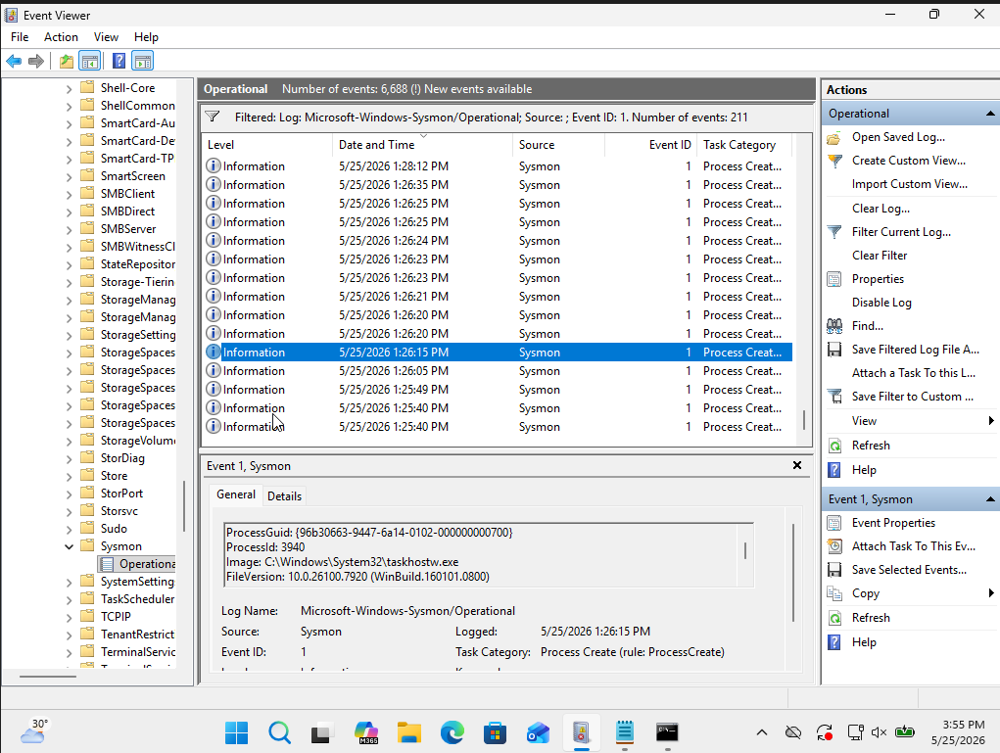
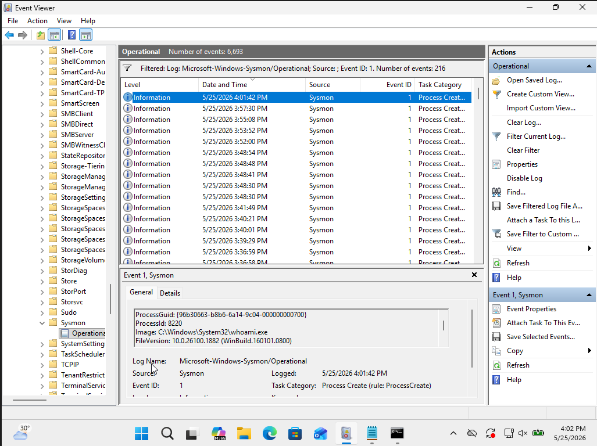
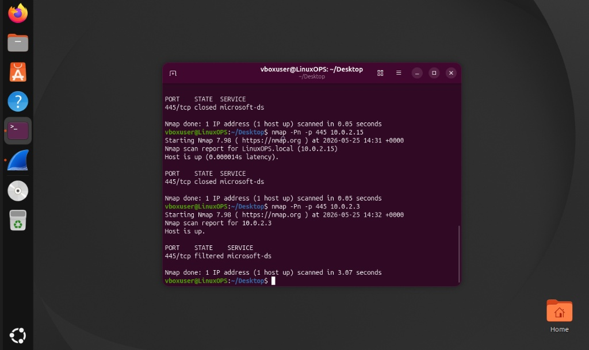
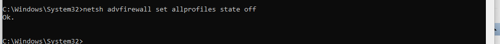
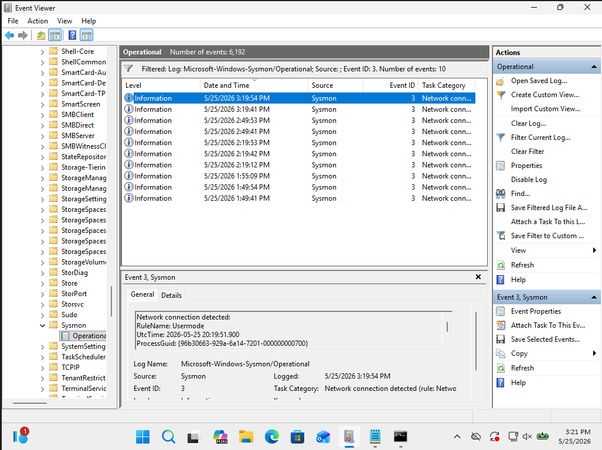
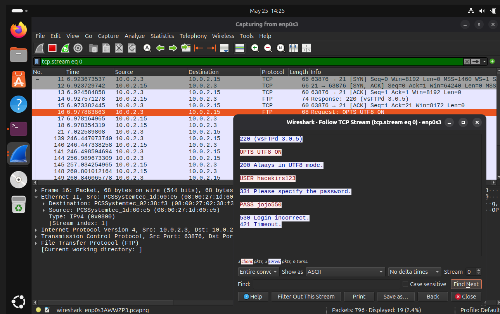

# Home SOC Lab: Endpoint Telemetry and Network Forensics

### Project Overview

This home lab was built to simulate network reconnaissance, analyse endpoint logs, and inspect network traffic in an isolated environment. The goal was to configure security monitoring tools and understand how host-based defences impact network visibility.

### Security & Configuration Note
All IP addresses used in this lab (specifically the `10.0.2.0/24` subnet) belong to the private network range defined in RFC 1918. These are non-routable, isolated addresses used exclusively within the VirtualBox host-only/NAT network environment. No actual infrastructure or public IPs were exposed during this simulation.

## Technical Stack

* Hypervisor: Oracle VirtualBox

* Target Machine: Windows 11

* Attacker/Analyst Machine: Ubuntu Linux

* Tools: Microsoft Sysmon, Wireshark, Windows Event Viewer, Nmap, vsFTPd

# Environment Setup & Installation

To replicate this environment, the following configuration and installation steps were performed:

### Network & Virtual Machine Configuration

Installed Oracle VirtualBox and created two virtual machines: Windows 11 (Target) and Ubuntu Linux (Attacker).

Configured a NAT Network (subnet 10.0.2.0/24) in VirtualBox preferences to allow secure communication between both virtual machines while keeping them isolated from the physical home network.

Assigned static IP addresses to ensure reliable communication (Windows host: 10.0.2.3).

### Windows Endpoint Setup (Sysmon Installation)

Downloaded Microsoft Sysmon from the official Sysinternals suite.

Downloaded a popular, security-hardened Sysmon configuration file (e.g., SwiftOnSecurity) to filter out noise and capture high-fidelity security events.

Installed Sysmon via administrative PowerShell/Command Prompt using the command:

sysmon.exe -i sysmonconfig-export.xml

Verified that the Microsoft-Windows-Sysmon/Operational event log channel was successfully created and active in the Windows Event Viewer.

### Ubuntu Attacker Setup (Wireshark & vsFTPd Installation)

Installed Nmap and Wireshark on the Ubuntu VM:

sudo apt update

sudo apt install nmap wireshark -y

Configured Wireshark to run without root privileges by reconfiguring the package and adding the user to the Wireshark group:

sudo dpkg-reconfigure wireshark-common

sudo usermod -aG wireshark $USER

Installed and configured vsFTPd (Very Secure FTP Daemon) to act as our plaintext FTP target:

sudo apt install vsftpd -y

sudo systemctl start vsftpd

sudo systemctl enable vsftpd

## Endpoint Monitoring and Troubleshooting

I deployed Microsoft Sysmon on the Windows endpoint to gather system events.

### Event Viewer Snap-in Crash

During log analysis, the Windows Event Viewer crashed with a System.InvalidOperationException error because of high log volume.

### Process Analysis (Event ID 1)

I analysed Event ID 1 (Process Creation) to check parent-child process relationships. Using the filtered logs, I verified the execution details of system tools:

Launching Notepad from Windows Search showed the parent process as taskhostw.exe.

Launching commands like whoami successfully generated an Event ID 1 log, showing the exact image path and process ID.

### Network Reconnaissance and Firewall Configuration

From the Ubuntu machine, I used Nmap to scan port 445 (SMB) on the Windows host.

### Port Filtered State

The initial scan returned a filtered state. This happened because the default Windows Defender Firewall profiles were active and silently dropping incoming TCP probes.

### Disabling Firewall for Telemetry Capture

To allow the network traffic to reach the OS layer so Sysmon could log the activity, I disabled the firewall profiles via Windows CMD:

netsh advfirewall set allprofiles state off

### Capturing Event ID 3

After disabling the firewall and scanning the correct Windows IP address (10.0.2.3), the packets successfully reached the host. This immediately generated an Event ID 3 (Network Connection Detected) log inside Sysmon, capturing the source IP, destination IP, and target port.

### Packet Inspection with Wireshark

I configured Wireshark on Ubuntu to capture traffic on the virtual network interface. To do this without root permissions, I reconfigured wireshark-common and managed dumpcap privileges.

Plaintext FTP Credential Capture

To test unencrypted traffic, I configured a vsFTPd server on Ubuntu and connected to it from the Windows machine. Using Wireshark's "Follow TCP Stream" feature, I recovered the login credentials directly from the traffic stream because FTP transmits data in plain text.

Analysis of the filtered state for 10.0.2.3

The Command:
nmap -Pn -p 445 10.0.2.3

What it does:
This command probes TCP port 445 (SMB) on the target host while bypassing the standard "ping" (host discovery) phase. By using -Pn, you force the scan to proceed even if the target is configured to ignore ICMP requests.

Why is this happening:
This is a direct result of an active Windows Defender Firewall profile on the target machine. The firewall is configured to silently drop incoming TCP packets destined for port 445. Because the firewall discards the packets instead of sending a rejection message, Nmap is left waiting for a response that never arrives, leading it to mark the port as filtered.

What this tells you:

Active Defence: The host is not simply unprotected; it has an active firewall policy that successfully obscures the service status from your network scans.

Reduced Visibility: The firewall is effectively hiding the SMB service. You cannot confirm if the service is running or what version it is, because the firewall acts as a barrier that prevents your scan probes from reaching the target application.

## Conclusion and Skills Verified

Log Analysis: Filtering and tracking Sysmon Event ID 1 and Event ID 3.

Network Tools: Using Nmap flags and troubleshooting port states (open, closed, filtered).

Packet Analysis: Using Wireshark display filters and rebuilding TCP streams.

Troubleshooting: Resolving Windows MMC snap-in issues and Linux packet capture permissions.
