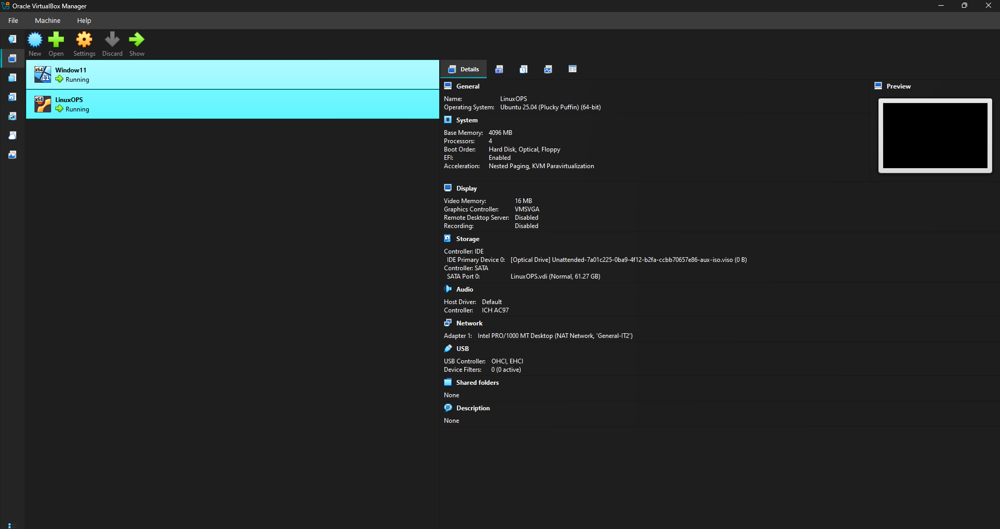
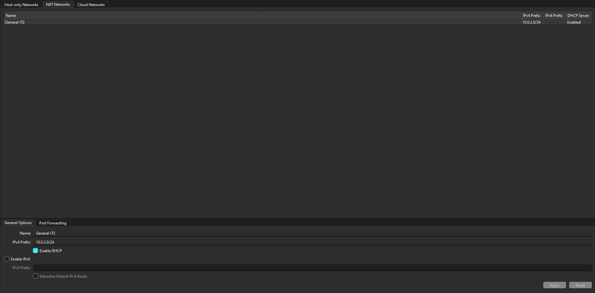
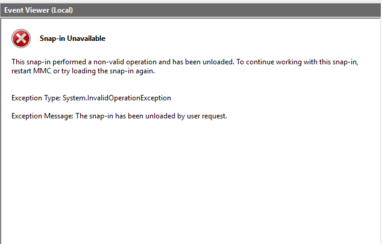

# Home SOC Lab: Endpoint Telemetry and Network Forensics

## Project Overview

This home lab was built to simulate network reconnaissance, analyze endpoint logs, and inspect network traffic in an isolated environment. The goal was to configure security monitoring tools and understand how host-based defenses impact network visibility.

## Technical Stack

* Hypervisor: Oracle VirtualBox

* Target Machine: Windows 11

* Attacker/Analyst Machine: Ubuntu Linux

* Tools: Microsoft Sysmon, Wireshark, Windows Event Viewer, Nmap, vsFTPd

# Environment Setup & Installation

To replicate this environment, the following configuration and installation steps were performed:

## Network & Virtual Machine Configuration

Installed Oracle VirtualBox and created two virtual machines: Windows 11 (Target) and Ubuntu Linux (Attacker).

Configured a NAT Network (subnet 10.0.2.0/24) in VirtualBox preferences to allow secure communication between both virtual machines while keeping them isolated from the physical home network.

Assigned static IP addresses to ensure reliable communication (Windows host: 10.0.2.3).

## Windows Endpoint Setup (Sysmon Installation)

Downloaded Microsoft Sysmon from the official Sysinternals suite.

Downloaded a popular, security-hardened Sysmon configuration file (e.g., SwiftOnSecurity) to filter out noise and capture high-fidelity security events.

Installed Sysmon via administrative PowerShell/Command Prompt using the command:

sysmon.exe -i sysmonconfig-export.xml

Verified that the Microsoft-Windows-Sysmon/Operational event log channel was successfully created and active in the Windows Event Viewer.

3. Ubuntu Attacker Setup (Wireshark & vsFTPd Installation)

Installed Nmap and Wireshark on the Ubuntu VM:

sudo apt update && sudo apt install nmap wireshark -y

Configured Wireshark to run without root privileges by reconfiguring the package and adding the user to the wireshark group:

sudo dpkg-reconfigure wireshark-common
sudo usermod -aG wireshark $USER

Installed and configured vsFTPd (Very Secure FTP Daemon) to act as our plaintext FTP target:

sudo apt install vsftpd -y
sudo systemctl start vsftpd
sudo systemctl enable vsftpd

---

## Endpoint Monitoring and Troubleshooting

I deployed Microsoft Sysmon on the Windows endpoint to gather system events.

# Event Viewer Snap-in Crash

During log analysis, the Windows Event Viewer crashed with a System.InvalidOperationException error because of high log volume.

## Process Analysis (Event ID 1)

I analyzed Event ID 1 (Process Creation) to check parent-child process relationships. Using the filtered logs, I verified the execution details of system tools:

Launching Notepad from Windows Search showed the parent process as taskhostw.exe.

Launching commands like whoami successfully generated an Event ID 1 log, showing the exact image path and process ID.

## Network Reconnaissance and Firewall Configuration

From the Ubuntu machine, I used Nmap to scan port 445 (SMB) on the Windows host.

## Port Filtered State

The initial scan returned a filtered state. This happened because the default Windows Defender Firewall profiles were active and silently dropping incoming TCP probes.

Disabling Firewall for Telemetry Capture

To allow the network traffic to reach the OS layer so Sysmon could log the activity, I disabled the firewall profiles via Windows CMD:

netsh advfirewall set allprofiles state off

## Capturing Event ID 3

After disabling the firewall and scanning the correct Windows IP address (10.0.2.3), the packets successfully reached the host. This immediately generated an Event ID 3 (Network Connection Detected) log inside Sysmon, capturing the source IP, destination IP, and target port.

## Packet Inspection with Wireshark

I configured Wireshark on Ubuntu to capture traffic on the virtual network interface. To do this without root permissions, I reconfigured wireshark-common and managed dumpcap privileges.

Plaintext FTP Credential Capture

To test unencrypted traffic, I configured a vsFTPd server on Ubuntu and connected to it from the Windows machine. Using Wireshark's "Follow TCP Stream" feature, I recovered the login credentials directly from the traffic stream because FTP transmits data in plain text.

## Conclusion and Skills Verified

Log Analysis: Filtering and tracking Sysmon Event ID 1 and Event ID 3.

Network Tools: Using Nmap flags and troubleshooting port states (open, closed, filtered).

Packet Analysis: Using Wireshark display filters and rebuilding TCP streams.

Troubleshooting: Resolving Windows MMC snap-in issues and Linux packet capture permissions.
